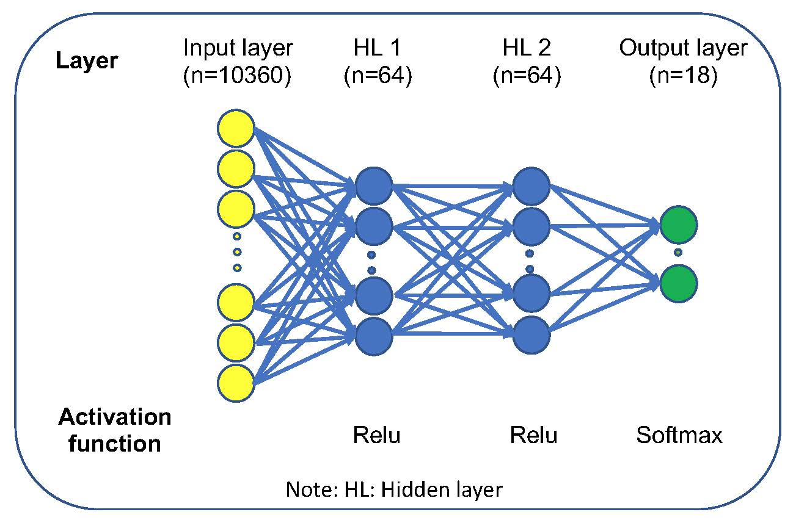

# Cancer origin prediction
## Introduction
   Identification of cancer tissue of origin is a routine in clinical practice in oncology. This is typically carried out with immunohistochemistry panels on the tumor specimen and imaging tests. Some cancer origins are easy to be determined and others are very difficult, especially for metastatic and un-differentially cancer. Accumulative evidence indicates that site-specific treatments improve patient outcomes. However, pathologic-based procedures need considerable resources, time, and expense. In addition, it can only achieve 66-88% of accuracy in metastatic cancer. Existing gene expression- or microRNA-based techniques also have limited performance. 
   
   We developed a deep neuron network (DNN)-based tissue of origin classifier using DNA methylation data of 7,339 patients from The Cancer Genome Atlas (TCGA) that cover 18 different cancer origins. 


## Data ##

<p align="center">
  
</p>

## DNN model

<p align="center">
  
</p>

## Documentation
**1. data/GEO**

  Due to large data, only data from GEO are available here for testing our model, which contains data from 581 patients across 10 cancer origins.

**2. src**
   Source codes for this project
   Dependency: python 3.6.3, pandas 0.21.0, numpy 1.13.3, tensorflow 1.4.0, sklearn 0.19.1
   
   *data:* A package folder contains python modules for data preparation from raw data to tfrecords formatted data. Please don't run since raw data is big and not included in Data folder

   *model:*  A package folder contains python modules for DNN model training and evaluation.

   **usage:**
   ```python
   usage: main.py [-h] parafile
   Get performance of cancer origin prediction model using test data

   positional arguments:
      parafile    A file containing parameters including running type and input file

   optional arguments:
      -h, --help  show this help message and exit

   ```
   **For example:**
   ```python
   python3 ./src/model/main.py ./data/paralist/test.txt
  ```
 **3. DNN_model**
   
   best_model folder contains the best model obtained from optimization of hyperparameters.
   
   cv_model folder contains the models from 10 fold cross-validation. 
   
 **4. results**
   
   This fold contains model performance in different data and predicted cancer origins using DNN-based cancer origin prediction model. Performace metrics include accuracy,  confusion_matrix, specificity, sensitivity, positive predictive value and negative predictive value.
  
 **5. figures**
   This fold contains ROC curves and precision-recall curves obtained from prediction results for evaluation data.
   
 **6. notebook**
     A jupyter notebook that replicates all the machine learning experiments from data preparation, model building and optimization, model evaluation. 
     To execute this notebook, the environment needs to be firstly created according to the provided cancer_origin.yml file. 
